<!-- ═══════════════════════════════════════════════════════════════════════ -->
<!--                      ◈ GIT-CITY HEADER ◈                             -->
<!-- ═══════════════════════════════════════════════════════════════════════ -->

  

<!-- ═══════════ STATUS BADGES ═══════════ -->

&nbsp;&nbsp;

&nbsp;&nbsp;

  

 

  

 

<!-- ═══════════════════════════════════════════════════════════════════════ -->
<!--                         ◈ THE ARCHITECT ◈                             -->
<!-- ═══════════════════════════════════════════════════════════════════════ -->

  

 

<table>
<tr>
<td align="center">
 

 

 

 

 

 

 

  
</td>
</tr>
</table>

 

  

 

<!-- ═══════════════════════════════════════════════════════════════════════ -->
<!--                       ◈ WHAT I ARCHITECT ◈                            -->
<!-- ═══════════════════════════════════════════════════════════════════════ -->

  

 

<table>
<tr>

<td width="33%" align="center">
 

  

  

  

  
</td>

<td width="33%" align="center">
 

  

  

  

  
</td>

<td width="33%" align="center">
 

  

  

  

  
</td>

</tr>
</table>

 

  

 

<!-- ═══════════════════════════════════════════════════════════════════════ -->
<!--                         ◈ TECH ARSENAL ◈                              -->
<!-- ═══════════════════════════════════════════════════════════════════════ -->

  

 

<table>
<tr>
<td align="center">
 

  

  

  
</td>
</tr>
</table>

 

<table>
<tr>
<td align="center">
 

  

  

  
</td>
</tr>
</table>

 

<table>
<tr>
<td align="center">
 

  

  

  
</td>
</tr>
</table>

 

<table>
<tr>
<td align="center">
 

  

  

  
</td>
</tr>
</table>

 

<table>
<tr>
<td align="center">
 

  

  

  
</td>
</tr>
</table>

 

  

 

<!-- ═══════════════════════════════════════════════════════════════════════ -->
<!--                       ◈ GITHUB ANALYTICS ◈                            -->
<!-- ═══════════════════════════════════════════════════════════════════════ -->

  

 

  
  &nbsp;&nbsp;
  

 

  

 

  

 

<!-- ═══════════════════════════════════════════════════════════════════════ -->
<!--                     ◈ CONTRIBUTION TIMELINE ◈                         -->
<!-- ═══════════════════════════════════════════════════════════════════════ -->

  

 

  

 

  

 

<!-- ═══════════════════════════════════════════════════════════════════════ -->
<!--                         ◈ ACHIEVEMENTS ◈                              -->
<!-- ═══════════════════════════════════════════════════════════════════════ -->

  

 

  

 

  

 

<!-- ═══════════════════════════════════════════════════════════════════════ -->
<!--                      ◈ CONTRIBUTION SNAKE ◈                           -->
<!--                                                                       -->
<!--  Requires a GitHub Action. Create .github/workflows/snake.yml:        -->
<!--                                                                       -->
<!--     name: Generate Snake                                              -->
<!--     on:                                                               -->
<!--       schedule:                                                       -->
<!--         - cron: "0 0 * * *"                                           -->
<!--       workflow_dispatch:                                               -->
<!--     jobs:                                                             -->
<!--       build:                                                          -->
<!--         runs-on: ubuntu-latest                                        -->
<!--         steps:                                                        -->
<!--           - uses: Platane/snk@v3                                      -->
<!--             with:                                                     -->
<!--               github_user_name: ShoaibAli7869                         -->
<!--               outputs: |                                              -->
<!--                 dist/github-snake.svg                                 -->
<!--                 dist/github-snake-dark.svg?palette=github-dark        -->
<!--           - uses: crazy-max/ghaction-github-pages@v3.1.0              -->
<!--             with:                                                     -->
<!--               target_branch: output                                   -->
<!--               build_dir: dist                                         -->
<!--             env:                                                      -->
<!--               GITHUB_TOKEN: ${{ secrets.GITHUB_TOKEN }}               -->
<!-- ═══════════════════════════════════════════════════════════════════════ -->

  

 

  <picture>
    <source media="(prefers-color-scheme: dark)" srcset="https://raw.githubusercontent.com/ShoaibAli7869/ShoaibAli7869/output/github-snake-dark.svg" />
    <source media="(prefers-color-scheme: light)" srcset="https://raw.githubusercontent.com/ShoaibAli7869/ShoaibAli7869/output/github-snake.svg" />
    
  </picture>

 

  

 

<!-- ═══════════════════════════════════════════════════════════════════════ -->
<!--                        ◈ LET'S CONNECT ◈                             -->
<!-- ═══════════════════════════════════════════════════════════════════════ -->

  

 

  
  &nbsp;&nbsp;
  
  &nbsp;&nbsp;
  

  

<!-- ═══════════════════════════════════════════════════════════════════════ -->
<!--                         ◈ PREMIUM FOOTER ◈                           -->
<!-- ═══════════════════════════════════════════════════════════════════════ -->

 

  

◈ If my work adds value to yours, a ⭐ speaks volumes ◈

 

Crafted with precision by <a href="https://github.com/ShoaibAli7869"><b>Shoaib Ali</b></a>

  

